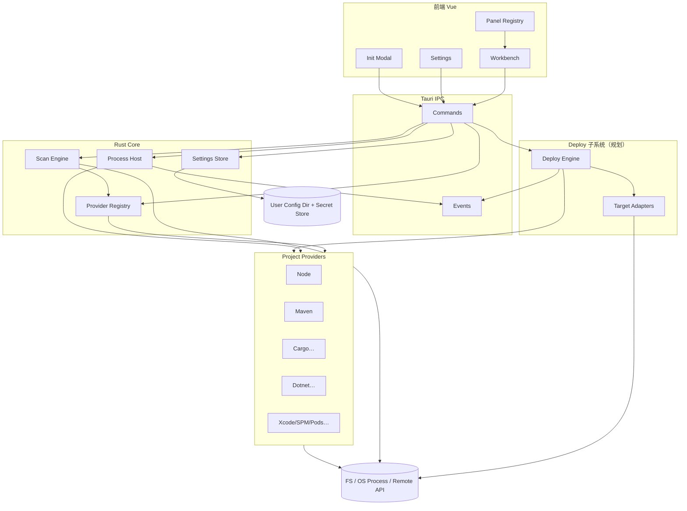
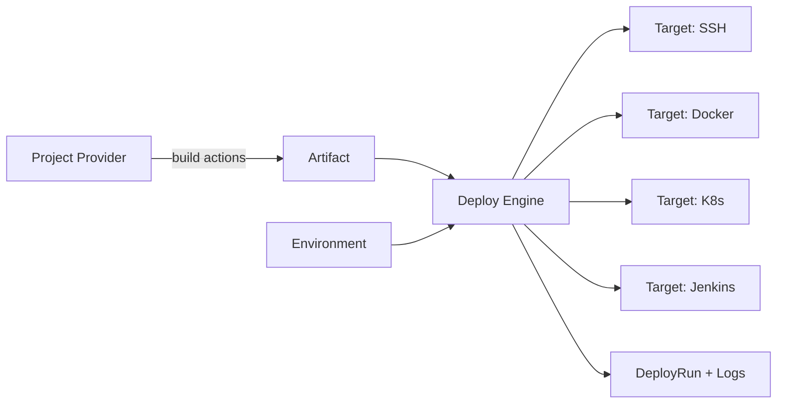
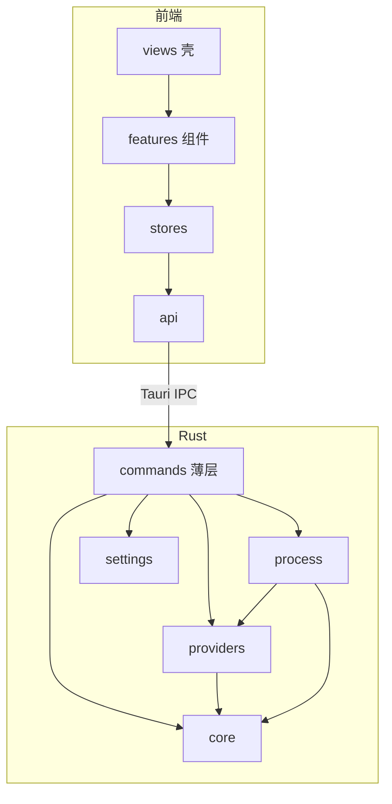

# DevKit 详细设计文档（重构基线）

> 版本：2026-07-18（修订：跨平台 + 可扩展生态 + 部署/交付预留）  
> 范围：现有实现（`src/` + `src-tauri/`）+ 最新 UI 原型（`prototype/devkit-ui.html`）  
> 目的：作为**整体重构**的需求、架构与模块边界基线，而非逐文件变更说明。  
> 一等公民平台：**Windows / macOS / Linux**

---

## 1. 产品定位

**DevKit** 是面向 Monorepo / 多工程工作区的本地桌面工作台：

- 在 **Windows / macOS / Linux** 上选择仓库根目录并扫描子项目
- 按**项目类型（Kind）**分组管理（首期 Node / Maven；架构上可扩展至 Rust、.NET、Xcode/Swift、CocoaPods 等）
- 对单个项目执行与其工具链匹配的动作（脚本、构建、运行、测试等）
- 支持**多实例**运行；每个实例具备可扩展的观测面板（日志、依赖、监控……）
- 通过用户级配置文件管理工具链安装路径、主题与语言
- **（规划）** 面向环境的一键部署 / 交付：远程服务器、Docker、Kubernetes、Jenkins 等（架构预留，非首期实现）

目标用户：在同一工作区中并行维护多种语言 / 包管理器子工程，并可能将构建产物交付到多种运行环境的开发者。

### 1.1 生态演进预期（设计必须预留）

| 阶段 | Kind / 生态示例 | 典型包管理 / 构建 |
|------|-----------------|-------------------|
| **已有** | `node`、`maven` | npm/pnpm/yarn/bun、Maven |
| **近中期** | `cargo`（Rust）、`dotnet`、`gradle` | Cargo、NuGet / `dotnet` CLI、Gradle |
| **近中期** | `xcode` / `spm` / `cocoapods` | Xcode 工程、SwiftPM、CocoaPods（偏 macOS） |
| **远期** | `go`、`python`、`cmake` 等 | Go modules、pip/poetry/uv、CMake… |

原则：**新增一种项目类型 = 注册一个 Project Provider**，不改动扫描内核与工作台壳层。

### 1.2 部署 / 交付演进预期（设计必须预留）

| 阶段 | 目标类型（Target） | 典型能力 |
|------|-------------------|----------|
| **规划** | `ssh` / `winrm` | 一键部署到指定 Linux / Windows 服务器 |
| **规划** | `docker` / `compose` | 构建镜像、推送到仓库、部署到指定 Docker 主机 |
| **规划** | `kubernetes` | 生成/应用 Deployment、Service、Ingress 等到指定集群/命名空间 |
| **规划** | `jenkins` | 按环境配置生成 Pipeline 脚本；调用 Jenkins API 创建/更新 Job 并触发构建 |
| **更远期** | `gitlab_ci` / `github_actions` / 云厂商 | 同类「生成配置 + 远程编排」模式复用 Deploy 内核 |

原则：**新增一种部署目标 = 注册一个 Deploy Target Adapter**；构建产物、环境、密钥、流水线步骤与具体运维通道解耦。

---

## 2. 设计原则

| 原则 | 说明 |
|------|------|
| 三平台一等公民 | Windows / macOS / Linux 均为正式支持目标；路径、进程、探测、权限差异必须抽象，禁止「仅 macOS 能用」的硬编码 |
| 原型即 UX 真源 | 交互与信息架构以 `prototype/devkit-ui.html` 为准；实现可落后，但重构应对齐原型 |
| 设置文件即配置真源 | 运行时配置持久化在用户级配置目录，不写进仓库 |
| Provider 可插拔 | 项目识别、动作、依赖、运行时、监控面板均通过 trait / 注册表扩展，核心不写 `if kind == "maven"` 长链 |
| 部署通道可插拔 | 服务器 / Docker / K8s / Jenkins 等通过 **Deploy Target Adapter** 扩展；核心只编排 Artifact → Environment → Pipeline |
| 密钥与配置分离 | 主机密码、Kubeconfig、Jenkins Token 等进安全存储，不进仓库、不进普通 settings 明文 |
| 能力声明驱动 UI | 前端面板 Tab **不是写死三个**；由项目 Kind、实例能力与部署能力共同声明 |
| 不硬编码执行版本 | 运行时由**项目元数据要求 + 设置中的工具链列表**解析，禁止写死版本号执行 |
| 实例为观测主键 | 日志 / 依赖 / 监控等能力挂在 **Instance**（及所属 ProjectRef）上，便于多实例与多面板扩展 |
| 紧凑工作台密度 | 高信息密度；设置页为全页而非模态 |
| 外观可换色系 | 主题切换必须同时更新主色与表面/边框等衍生色 |
| 国际化可扩展 | 默认 zh-CN / zh-TW / en / ja；文案集中管理 |
| 前后端边界清晰 | Tauri commands + events；UI 不直接碰进程 / 文件系统扫描逻辑 |
| 模块拆分强制 | **禁止**再出现 `App.vue` / 单文件 Rust 承载全部业务；按特性（feature）与领域边界拆分，见 §12 |

---

## 3. 技术栈（当前）

| 层 | 技术 |
|----|------|
| 桌面壳 | Tauri 2 |
| 前端 | Vue 3.5 + Vite 6 |
| UI 组件 | antdv-next + @antdv-next/icons |
| 后端 | Rust（`scan` / `process` / `deps` / `runtime` / `commands`） |
| 插件 | `tauri-plugin-dialog`、`tauri-plugin-opener` |
| 原型 | 单文件 HTML/CSS/JS（无框架），用于 UX 迭代 |

### 工程脚本

- `npm run dev` — Vite 前端预览（无 Tauri，`previewMode`）
- `npm run tauri` — 桌面应用开发/构建入口
- `npm run build` / `preview` — 前端构建与预览

### 模块化目标（摘要）

当前问题：`src/App.vue`（2000+ 行）与部分 Rust 文件承担过多职责，难以测试与扩展。

**重构硬性目标：**

| 约束 | 建议阈值 |
|------|----------|
| 单个 `.vue` 文件 | 理想 &lt; 300 行；超过 500 行必须拆分 |
| 单个 `.rs` 业务文件 | 理想 &lt; 400 行；超过 800 行必须拆分 |
| `App.vue` | **仅**应用壳：视图切换 + 全局 Provider 挂载，&lt; 150 行 |
| `commands.rs` | **仅** IPC 薄封装，无业务逻辑 |
| 新增 Kind / Target / Panel | 只新增目录与注册，不扩大壳层文件 |

完整目录、依赖方向与职责表见 **§12 前后端模块拆分规范**。

---

## 4. 总体架构



### 4.1 分层职责

| 层 | 职责 | 禁止 |
|----|------|------|
| **Scan Engine** | 遍历目录、应用忽略规则、对每个目录调用已注册 Detector | 识别具体语言/包管理器 |
| **Provider** | 识别 Kind、解析元数据、列出 Actions、解析依赖、解析运行时、贡献面板能力 | 修改遍历算法 |
| **Process Host** | 统一 spawn/stop/日志缓冲/端口嗅探；通过 Provider 取得 argv/env | 写死 `mvn`/`npm` 字符串分支 |
| **Settings** | 通用 schema + 按 toolchainId 的扩展段 | 每加一门语言就改核心结构体字段名 |
| **Frontend Panel Registry** | `panelId → Vue 组件`；按能力列表渲染 Tab | 写死「永远只有三个 Tab」 |
| **Deploy Engine（规划）** | Artifact × Environment × Pipeline 编排 | 在 Kind 内写死 scp/kubectl/Jenkins API |

### 4.2 关键事件（可扩展）

| 事件名 | Payload | 用途 |
|--------|---------|------|
| `init-progress` | `{ step, percent, found?, detail?, done }` | 首次初始化（step 由 ToolchainDetector 贡献） |
| `project-log` | `{ projectKey, instanceId?, path, line }` | 日志流（绑定项目/实例） |
| `instance-metrics`（规划） | `{ instanceId, sample }` | 监控采样推送 |
| `provider-event`（规划） | `{ kind, type, payload }` | Provider 自定义事件（如构建进度） |
| `deploy-progress`（规划） | `{ runId, stage, percent, message, done }` | 部署/流水线进度 |
| `deploy-log`（规划） | `{ runId, line }` | 部署日志流 |

---

## 5. 跨平台设计（Windows / macOS / Linux）

### 5.1 平台矩阵

| 能力 | macOS | Linux | Windows |
|------|-------|-------|---------|
| 目录选择 / 扫描 | ✅ | ✅ | ✅（路径规范化、长路径） |
| 子进程启动 | ✅ | ✅ | ✅（`.cmd` / `.exe`、无 `setpgid`） |
| 停止进程树 | `kill` 进程组 | 同左 | `taskkill /T /F`（已有方向） |
| which / PATH | POSIX | POSIX | `where.exe` / PATHEXT |
| 端口探测 | `lsof` 等 | `ss`/`lsof` | `netstat` / `Get-NetTCPConnection` 抽象 |
| 用户配置目录 | `~/.devkit/` | `~/.devkit/` | `%APPDATA%\devkit\`（或 `~/.devkit` 双读兼容） |
| Xcode / CocoaPods / SPM | 完整支持 | 识别可提示「需 macOS」 | 识别可提示不可用 |
| 路径分隔与盘符 | `/` | `/` | `\` + `C:\`；内部统一存绝对规范化路径 |

### 5.2 平台抽象（Rust `platform` 模块）

必须提供统一 API，Provider 与 Host **只依赖抽象**：

```text
platform::config_dir() -> PathBuf
platform::home_dir() -> PathBuf
platform::path_sep / normalize_path / path_eq
platform::find_executable(name) -> Option<PathBuf>   // which/where
platform::kill_tree(pid) -> Result<()>
platform::list_listening_ports(pid) -> Vec<u16>
platform::shell_wrapper(argv) -> Command             // Win 上必要时经 cmd
platform::current_os() -> OsKind                     // macos | linux | windows
platform::is_capability_available(cap) -> bool       // 如 xcodebuild
```

### 5.3 Provider 的平台约束声明

```text
PlatformSupport = All | Unix | MacOnly | WindowsOnly | Custom(fn)
```

扫描时：不满足平台的 Kind **仍可识别并展示**，但 Actions 标记 `unavailableReason`（例如「CocoaPods 仅支持 macOS」），避免 silently 忽略导致用户困惑。

### 5.4 配置文件路径

| OS | 主路径 |
|----|--------|
| macOS / Linux | `$HOME/.devkit/settings.json` |
| Windows | `%APPDATA%\devkit\settings.json` |
| 兼容 | 若 Windows 上仅存在旧路径 `~\.devkit\settings.json`，加载时迁移到 APPDATA |

---

## 6. 可扩展核心：项目扫描与类型识别

> 本节是重构的**硬约束**：扫描与识别必须插件化，禁止在引擎内堆叠语言分支。

### 6.1 核心概念

| 概念 | 说明 |
|------|------|
| **KindId** | 稳定字符串 ID，如 `node`、`maven`、`cargo`、`dotnet`、`xcode`、`spm`、`cocoapods` |
| **ProjectRef** | `{ path, kind }` 的稳定身份；序列化键 `` `{normalizedPath}::{kind}` `` |
| **Detector** | 判断某目录是否构成该 Kind 的项目，并解析元数据 |
| **Provider** | 聚合 Detector + Actions + Deps + Runtime + Caps（面板能力） |
| **Manifest** | 触发识别的文件/目录模式（可多模式 OR/AND） |
| **Priority** | 同目录多 Detector 命中时的优先级与是否允许共存 |

### 6.2 Detector Trait（示意）

```rust
trait ProjectDetector: Send + Sync {
    fn kind(&self) -> KindId;
    fn group_label_key(&self) -> &str;      // i18n key，如 group.maven
    fn priority(&self) -> i32;              // 越大越优先（并存规则另见）
    fn platform(&self) -> PlatformSupport;

    /// 快速路径：仅看文件名/存在性，避免重 I/O
    fn probe(&self, dir: &Path, entries: &DirSnapshot) -> ProbeResult;
    // ProbeResult = Miss | Hit | NeedDeep

    /// 深度解析：读 package.json / pom / *.xcodeproj …
    fn enrich(&self, dir: &Path) -> Result<ProjectDraft, DetectError>;
}
```

`DirSnapshot`：引擎提供的目录项缓存（文件名集合），避免每个 Detector 重复 `read_dir`。

### 6.3 Scan Engine 算法

```text
1. 规范化 root（跨平台）
2. DFS/BFS，深度 ≤ max_depth（可配置，默认 6）
3. 目录名命中全局 ignore → 跳过
   （node_modules、.git、target、dist、build、.idea、Pods、.gradle、bin/obj… 可配置扩展）
4. 对每个目录：
   a. 收集 DirSnapshot
   b. 对 Registry 中全部 Detector 调用 probe
   c. 按「共存策略」生成 0..N 个 ProjectDraft
   d. 对 Hit 调用 enrich
5. 排序：group → name → path → kind
6. 返回 Vec<Project>
```

### 6.4 同目录多项目共存策略

| 策略 | 示例 |
|------|------|
| **AllowMultiple**（默认） | 同目录 `package.json` + `pom.xml` → Node + Maven 两条 |
| **ExclusiveGroup** | 互斥组内只保留 priority 最高者（如 `xcode` vs 裸 `spm` 可配置） |
| **ChildOwns** | 子目录已识别则父目录跳过某类（可选，防 workspace 根误报） |

策略由 Registry 配置，不写死在引擎。

### 6.5 Manifest 示例（未来扩展对照）

| KindId | 典型 Manifest | 包管理 / 工具 |
|--------|---------------|---------------|
| `node` | `package.json` | npm / pnpm / yarn / bun（lockfile 再细分 packageManager） |
| `maven` | `pom.xml` | Maven |
| `gradle` | `build.gradle` / `build.gradle.kts` / `settings.gradle*` | Gradle |
| `cargo` | `Cargo.toml` | Cargo |
| `dotnet` | `*.csproj` / `*.fsproj` / `*.sln` | NuGet / `dotnet` CLI |
| `xcode` | `*.xcodeproj` / `*.xcworkspace` | xcodebuild |
| `spm` | `Package.swift` | Swift Package Manager |
| `cocoapods` | `Podfile` | CocoaPods |
| `go` | `go.mod` | Go modules |
| `python` | `pyproject.toml` / `requirements.txt` / `Pipfile` | pip / poetry / uv… |

**PackageManager ≠ Kind：**  
例如 Kind=`node` 下再区分 `npm|pnpm|yarn|bun`；Kind=`dotnet` 下依赖源为 NuGet。字段建议：

```text
Project.package_manager: Option<String>  // "pnpm" | "nuget" | "spm" | …
Project.toolchains: Vec<ToolchainRef>    // 运行需要的运行时，如 jdk@17、node@20、dotnet@8
```

### 6.6 Provider 总接口（示意）

```rust
trait ProjectProvider: Send + Sync {
    fn kind(&self) -> KindId;
    fn detector(&self) -> &dyn ProjectDetector;

    fn list_actions(&self, project: &Project) -> Vec<ActionSpec>;
    fn resolve_command(&self, project: &Project, action_id: &str, ctx: &RunContext)
        -> Result<CommandSpec, RunError>;

    fn list_dependencies(&self, project: &Project, mode: DepMode)
        -> Result<Vec<DependencyNode>, DepError>;

    fn detect_required_toolchains(&self, project: &Project)
        -> Vec<ToolchainRequirement>;
    fn resolve_toolchains(&self, reqs: &[ToolchainRequirement], settings: &Settings)
        -> Result<EnvDelta, ResolveError>;

    /// 该 Kind 默认贡献的面板 / 能力（可被实例能力叠加）
    fn capabilities(&self, project: &Project) -> Vec<Capability>;
}
```

`CommandSpec`：`program + args + env + cwd + platform_hints`（Windows 可带 `program_alt`）。  
`EnvDelta`：对 `PATH` / `JAVA_HOME` / `DOTNET_ROOT` 等的增量修改。

### 6.7 注册与内置加载

```rust
fn register_builtin_providers(reg: &mut Registry) {
    reg.add(node::provider());
    reg.add(maven::provider());
    // reg.add(cargo::provider());
    // reg.add(dotnet::provider());
    // …
}

// 远期：从动态库 / 配置脚本加载第三方 Provider（非首期必做，API 先稳定）
```

**扩展一个新 Kind 的检查清单：**

1. 实现 `ProjectDetector` + `ProjectProvider`  
2. 在 `register_builtin_providers` 注册  
3. 补充 ToolchainDetector（若需设置页与首次初始化扫描）  
4. 前端：若有专用面板，注册 `panelId`；否则复用通用 Logs/Deps/Monitor  
5. i18n：`kind.*` / `group.*` / `action.*`  
6. 平台矩阵测试：Win / macOS / Linux CI  

---

## 7. 领域模型（通用化）

### 7.1 Project

| 字段 | 类型 | 说明 |
|------|------|------|
| `key` | string | `` `{path}::{kind}` `` |
| `path` | string | 规范化绝对路径 |
| `name` | string | 显示名 |
| `kind` | KindId | 稳定 ID，**非**封闭枚举 |
| `group` | string | 侧栏分组（可由 Provider 提供 i18n key） |
| `packageManager` | string? | 细分工具：`pnpm` / `nuget` / `spm`… |
| `actions` | ActionSpec[] | 可执行动作（替代仅 `scripts: string[]`） |
| `capabilities` | CapabilityId[] | 默认面板/能力 |
| `toolchains` | ToolchainRequirement[] | 运行所需工具链声明 |
| `metadata` | object | Provider 私有扩展（如 `springBoot`、`crateName`、`scheme`） |
| `dependencies` | DependencyNode[] | 可选初始依赖快照 |

**兼容现网：** 当前 `scripts: string[]` / `springBoot` 可在适配层映射为 `actions` + `metadata.springBoot`。

### 7.2 ActionSpec

| 字段 | 说明 |
|------|------|
| `id` | 如 `script:dev`、`lifecycle:package`、`dotnet:run` |
| `label` | 显示名或 i18n key |
| `group` | 溢出菜单分组（Scripts / Lifecycle / Dependencies…） |
| `primary` | 是否主按钮高亮 |
| `available` | 是否当前平台可用 |
| `unavailableReason` | 不可用原因 |

### 7.3 DependencyNode

通用树节点（NuGet / SPM / CocoaPods / Cargo / Maven 均可映射）：

| 字段 | 说明 |
|------|------|
| `key` | 稳定键 |
| `name` / `version` / `scope` | 展示 |
| `children?` | 嵌套 |
| `source?` | 来源：`registry` / `local` / `git`… |
| `metadata?` | Provider 扩展 |

`DepMode`：`Static`（读清单文件）| `Resolved`（调用工具生成锁树，如 `mvn dependency:tree`、`dotnet list package`、`cargo tree`）。

### 7.4 ProjectRef / Instance

| 概念 | 主键 | 说明 |
|------|------|------|
| **ProjectRef** | `path + kind` | 扫描出的工程 |
| **Instance** | `instanceId`（UUID 或 `pid`+启动序号） | 一次 `run_action` 产生的运行实体 |

```text
Instance {
  id, projectKey, pid?, actionId, kind,
  startedAt, port?, status,
  capabilities: CapabilityId[],   // 可在运行后动态增加
}
```

**进程 / 日志 / 监控一律优先挂 Instance**；UI「项目级」视图 = 聚合该 ProjectRef 下全部 Instance。

### 7.5 RuntimeEntry / Toolchain

| 字段 | 说明 |
|------|------|
| `toolchainId` | 如 `jdk`、`node`、`dotnet`、`rustup`、`xcode` |
| `id` / `version` / `path` / `label` / `manual` | 同现网 RuntimeEntry |
| `extra?` | 如 MSBuild 路径、sdk 列表 |

### 7.6 设置文件 Schema（可扩展）

**路径：** 见 §5.4。

**目标形状：**

```json
{
  "general": {
    "logWrap": true,
    "theme": "teal",
    "locale": "zh-CN",
    "scan": { "maxDepth": 6, "extraIgnores": [] }
  },
  "toolchains": {
    "jdk": { "installs": [/* RuntimeEntry */], "mavenHome": "…" },
    "node": { "installs": [/* … */] },
    "dotnet": { "installs": [] },
    "rust": { "installs": [] }
  },
  "providers": {
    "enabled": ["node", "maven", "cargo", "dotnet"],
    "disabled": [],
    "options": {
      "cocoapods": { "enabled": true }
    }
  },
  "environments": [],
  "targets": [],
  "deployProfiles": []
}
```

> `environments` / `targets` / `deployProfiles` 为**部署子系统预留字段**（详见 §9）；首期可为空数组，加载时忽略未知字段需保持前向兼容（`serde` 默认 deny_unknown 时要用 `#[serde(default)]` 或显式允许）。

**兼容现网：** 读取时将 `java.jdks` / `java.mavenHome` / `node.nodes` 迁移进 `toolchains.*`；保存可双写一阶段或版本位 `schemaVersion: 2`。

| 字段 | 取值 |
|------|------|
| `general.theme` | `teal` \| `ocean` \| `forest` \| `slate` \| `amber` \| `rose` |
| `general.locale` | `zh-CN` \| `zh-TW` \| `en` \| `ja` |

设置页左侧分类：**基本配置** + **每个已启用 Toolchain 一段** + **（规划）Environments / Targets**。

---

## 8. 可扩展面板与实例能力（日志 / 依赖 / 监控 / 更多 Tab）

> 不同打包工具、不同 Kind、甚至不同运行动作，可用的 Tab **数量与功能都可以不同**。UI 不得写死「永远 Logs + Deps + Monitor」。

### 8.1 Capability 模型

```text
Capability {
  id: CapabilityId,          // "panel.logs" | "panel.deps" | "panel.monitor" | "panel.artifacts" | …
  kind: Panel | Tool | Insight,
  titleKey: i18n key,
  order: i32,
  scope: Project | Instance | Both,
  when: Always | WhenRunning | WhenAction(actionId) | Custom,
  propsSchema?: …            // 前端面板可选配置
}
```

**解析顺序（合并去重）：**

1. Provider 对 Project 声明的默认 `capabilities`
2. 当前选中 Instance 动态追加的 capabilities（如 JVM attach 成功后增加 `panel.jvm`）
3. 用户偏好（钉选/隐藏某面板，可选）

前端根据合并结果渲染 **动态 Panel Tabs**。

### 8.2 内置与规划面板

| CapabilityId | 作用域 | 说明 | 适用示例 |
|--------------|--------|------|----------|
| `panel.logs` | Instance | 通用日志流 | 几乎所有 Kind |
| `panel.deps` | Project | 依赖树（Static/Resolved） | node/maven/cargo/dotnet/spm/cocoapods… |
| `panel.monitor` | Instance | 进程资源 + 运行时细节插槽 | 通用宿主 + Kind 插槽 |
| `panel.jvm`（规划） | Instance | JVM 专用（Heap/GC/Threads） | maven/gradle |
| `panel.node_insp`（规划） | Instance | V8 / event loop | node |
| `panel.artifacts`（规划） | Project | 构建产物浏览与部署选择 | maven/dotnet/xcode/通用 |
| `panel.schemes`（规划） | Project | Xcode Scheme / Target | xcode |
| `panel.pods`（规划） | Project | Pods 依赖与版本 | cocoapods |
| `panel.nuget`（规划） | Project | NuGet 包与源 | dotnet |
| `panel.test`（规划） | Project/Instance | 测试报告 | 多生态 |
| `panel.deploy`（规划） | Project | 一键部署 / 导出流水线 | 配置了 Environment 的项目 |
| `panel.releases`（规划） | Project | 发布历史与回滚 | 多 Target |

**监控面板内部再插件化：**  
通用块（CPU/Mem/Net/Disk/进程表）由 Host 提供；`RuntimeInsight` slot 由 Provider 填充（JVM / Node / .NET CLR / 无）。

### 8.3 前端 Panel Registry

```text
// 注册
registerPanel('panel.logs', LogsPanel)
registerPanel('panel.deps', DepsPanel)
registerPanel('panel.monitor', MonitorPanel)
registerPanel('panel.schemes', SchemesPanel)   // 未来

// 渲染
tabs = resolveCapabilities(project, instance)
activePanelId = tabState[projectKey] || tabs[0].id
<component :is="getPanel(activePanelId)" v-bind="panelCtx" />
```

未知 `panelId`：显示「尚未安装对应面板组件」占位，不崩溃。

### 8.4 实例级日志（可扩展）

| 能力 | 设计 |
|------|------|
| 缓冲键 | `instanceId`（主）；查询可按 `projectKey` 聚合 |
| 事件 | `project-log` 带 `instanceId` |
| 格式化器 | 可插拔 `LogFormatter`（ANSI、MSBuild、xcodebuild 等） |
| 导出/搜索/过滤 | 作为 Logs 面板子能力逐步加，不改 Host |
| 多通道（规划） | stdout / stderr / diagnostic 分 channel |

### 8.5 依赖面板（可扩展）

| 能力 | 设计 |
|------|------|
| 统一树模型 | `DependencyNode`（§7.3） |
| Provider 实现 | `list_dependencies(Static \| Resolved)` |
| UI | 通用树表；列定义可由 Capability props 覆盖（如增加「源」「许可证」） |
| 刷新 | `refresh_dependencies(projectKey, mode)` |

### 8.6 监控面板（可扩展）

| 层 | 内容 |
|----|------|
| Host 通用采样 | CPU、RSS、IO、端口（跨平台抽象） |
| Provider Insight | JVM / Node / CLR / 自定义 JSON 块 |
| 推送 | 轮询或 `instance-metrics` 事件 |
| 无实例 | 空态；不显示 Instance-scoped 面板或置灰 |

---

## 9. 部署与交付扩展架构（规划预留）

> **首期不实现业务功能**，但重构时必须留下稳定扩展点，避免将来把「一键部署」硬塞进 `process` 或某个 Kind 的 `if/else`。  
> 典型远期需求：一键部署到指定 Windows/Linux 服务器、指定 Docker 主机、指定 K8s 集群；按环境配置生成 Jenkins Pipeline；调用 Jenkins API 创建/更新 Job 并触发部署等。

### 9.1 设计目标

| 目标 | 说明 |
|------|------|
| 通道无关 | 核心不感知 SSH/Docker/K8s/Jenkins 细节 |
| 产物与环境解耦 | 同一 Artifact 可部署到多个 Environment |
| 可生成、可执行 | 既能「导出脚本/清单」，也能「直接执行/触发远程 API」 |
| 可审计 | 每次发布有 DeployRun 记录（谁、何时、何环境、何版本、结果/日志） |
| 可安全 | 凭证只存引用；UI 展示掩码；传输走 Adapter |

### 9.2 核心概念

```text
Artifact          构建产物抽象：jar/war、镜像 tag、静态资源包、ipa…
Environment       逻辑环境：dev/staging/prod 或自定义；绑定一个或多个 Target
DeployTarget      具体通道端点：某台 SSH 主机、Docker Host、K8s context、Jenkins 服务器
DeployProfile     项目 × 环境 的部署配置（路径、命名空间、服务名、健康检查…）
PipelineTemplate  步骤模板（可渲染为 shell / Jenkinsfile / kubectl apply 清单）
DeployJob         一次「要做的事」定义（选中的 profile + 参数）
DeployRun         一次执行记录（状态机 + 日志引用 + 外部 Job URL）
SecretRef         密钥引用 ID（指向系统钥匙串 / OS credential store / 加密库）
```

关系简述：



### 9.3 与现有体系的衔接

| 现有概念 | 部署侧用法 |
|----------|------------|
| ProjectProvider | 贡献「如何产出 Artifact」（如 `package`、`docker:build`）；可声明 `capability: panel.deploy` |
| ActionSpec | 可增加 `group: deploy` 的快捷动作（「部署到 staging」），内部转调 Deploy Engine |
| Capability / Panel | `panel.deploy`、`panel.artifacts`、`panel.releases` 等 Tab 按需出现 |
| Process Host / Instance | **本地**构建/打包进程仍走 Host；**远程**部署步骤走 Deploy Engine（可产生 DeployRun，日志可复用日志面板 channel） |
| Settings | `environments[]`、`targets[]`、SecretRef；与 toolchains 并列，勿塞进某个语言段 |

**禁止：** 在 `maven` provider 内直接写死「scp 到某 IP」；应通过 DeployProfile 引用 Target。

### 9.4 Deploy Target Adapter（示意 Trait）

```rust
trait DeployTargetAdapter: Send + Sync {
    fn target_kind(&self) -> TargetKindId;
    // "ssh" | "winrm" | "docker" | "kubernetes" | "jenkins" | …

    fn platform_support(&self) -> PlatformSupport;

    /// 校验目标连通性（ssh 探活、docker info、k8s version、jenkins crumb…）
    fn probe(&self, target: &DeployTarget, secrets: &SecretStore)
        -> Result<ProbeReport, DeployError>;

    /// 将 Pipeline 渲染为该通道可执行的具体计划
    fn plan(&self, ctx: &DeployContext) -> Result<DeployPlan, DeployError>;
    // DeployPlan = 本地命令列表 | 远程脚本 | API 调用序列 | 清单文件集

    /// 执行计划（可异步；通过事件推送进度）
    fn execute(&self, plan: &DeployPlan, ctx: &DeployContext)
        -> Result<DeployRunHandle, DeployError>;

    /// 可选：仅生成产物（Jenkinsfile、k8s YAML、deploy.sh）不执行
    fn export(&self, ctx: &DeployContext) -> Result<Vec<ExportedFile>, DeployError>;
}
```

`DeployContext` 包含：`project`、`artifact`、`environment`、`profile`、`params`、`secret_resolver`。

### 9.5 Deploy Engine（编排内核）

稳定流水线阶段（阶段可跳过，由 Profile 声明）：

```text
1. resolve      解析 Profile / 变量（环境变量模板、版本号、git sha）
2. build        可选：调用 ProjectProvider 动作产出 Artifact
3. publish      可选：推送镜像/制品库
4. render       渲染脚本或清单（Jinja/Handlebars 类模板或结构化生成器）
5. apply        调用 Target Adapter.execute
6. verify       可选：健康检查 / 烟测
7. record       写入 DeployRun
```

Engine **只编排阶段**；`build` 委托 ProjectProvider，`apply` 委托 Target Adapter。

### 9.6 目标类型规划

| TargetKind | 一键部署含义 | export 示例 | execute 示例 |
|------------|--------------|-------------|--------------|
| `ssh` | 部署到 Linux 服务器 | `deploy.sh`、systemd unit | SSH 上传 + 远程执行 |
| `winrm` / `ssh+windows` | 部署到 Windows 服务器 | PowerShell / NSSM 脚本 | WinRM 或 SSH 执行 |
| `docker` | 部署到指定 Docker | Dockerfile、compose 片段 | `docker build/push/run` 或远程 Docker API |
| `kubernetes` | 部署到指定集群/命名空间 | Deployment/Service YAML | `kubectl apply` 或官方 client |
| `jenkins` | 交付到 Jenkins | `Jenkinsfile` | REST/API：创建或更新 Job、触发 Build、轮询状态 |
| `gitlab_ci` 等（更远） | 同「生成 + 可选触发」模式 | `.gitlab-ci.yml` 片段 | API 触发 Pipeline |

**Jenkins 专项（规划细节）：**

1. 从 Environment + DeployProfile 读取：Job 名、节点标签、凭据 ID、构建参数  
2. `export` → 生成声明式/脚本式 Pipeline 文本  
3. `execute` → Jenkins API：`createItem` / `update` Job 配置 → `buildWithParameters` → 订阅/轮询 Build 日志，映射为 `DeployRun` 进度事件  
4. 不在核心写死 Groovy；模板由 `PipelineTemplate`（可按 Kind 覆盖，如 Maven 与 Node 不同阶段）

### 9.7 配置与密钥（规划 Schema）

```json
{
  "environments": [
    {
      "id": "staging",
      "name": "Staging",
      "targetIds": ["ssh-staging-1", "k8s-staging"],
      "vars": { "NAMESPACE": "staging", "REPLICAS": "2" }
    }
  ],
  "targets": [
    {
      "id": "ssh-staging-1",
      "kind": "ssh",
      "host": "10.0.0.12",
      "port": 22,
      "user": "deploy",
      "auth": { "type": "privateKey", "secretRef": "sec-ssh-staging" }
    },
    {
      "id": "jenkins-main",
      "kind": "jenkins",
      "baseUrl": "https://ci.example.com",
      "auth": { "type": "apiToken", "secretRef": "sec-jenkins" }
    }
  ],
  "deployProfiles": [
    {
      "id": "api-staging",
      "projectKeyHint": "kind=maven",
      "environmentId": "staging",
      "targetId": "jenkins-main",
      "templateId": "jenkins.maven.deploy",
      "params": { "jobName": "monorepo-api-staging" }
    }
  ]
}
```

密钥：`SecretStore`（钥匙串 / DPAPI / libsecret / 加密文件），settings 仅存 `secretRef`。

### 9.8 UI 扩展点（规划）

| UI | 说明 |
|----|------|
| 设置 → Environments / Targets | 管理环境与通道；探测连通性 |
| 面板 `panel.deploy` | 选择环境 → 预览计划 → 导出或执行 → 查看 DeployRun |
| 面板 `panel.artifacts` | 本地/远程产物列表，供部署选择 |
| 面板 `panel.releases` | 历史发布与回滚入口（Adapter 可选支持） |
| ActionBar `group: deploy` | 「部署到…」快捷入口 |

Tab 是否出现：由 Project capabilities + 用户是否配置了 Environments 共同决定。

### 9.9 事件与 Command（规划）

| 事件 | 用途 |
|------|------|
| `deploy-progress` | `{ runId, stage, percent, message, done }` |
| `deploy-log` | 复用或并列于日志通道 |

| Command（规划） | 说明 |
|-----------------|------|
| `list_deploy_targets` / `probe_deploy_target` | 目标管理 |
| `list_environments` | 环境 |
| `plan_deploy` / `export_deploy` / `run_deploy` | 计划 / 导出 / 执行 |
| `list_deploy_runs` / `get_deploy_run` | 历史 |
| `render_pipeline(templateId, ctx)` | 仅生成 Jenkinsfile 等 |

### 9.10 扩展检查清单（新增部署通道）

1. 实现 `DeployTargetAdapter`（probe / plan / execute / export）  
2. 注册到 Deploy Registry  
3. 定义默认 `PipelineTemplate`（可按 Project Kind 覆盖）  
4. Secret 类型声明（password / privateKey / kubeconfig / apiToken…）  
5. 前端：Target 表单字段 schema + 可选专用面板区块  
6. i18n；三平台（或声明 MacOnly 等）测试  
7. **不修改** Scan Engine / Process Host / 其它 Target  

### 9.11 安全与合规约束

- 默认不在日志中打印密钥、Token、私钥内容  
- 生产 Environment 可要求二次确认 / 定时窗口（Profile 策略）  
- Jenkins/K8s API 调用失败要可诊断（HTTP 状态、权限不足）且不破坏本地工作台  
- 导出的脚本默认不含明文密钥，仅含占位符或凭据 ID  

---

## 10. 功能清单（产品行为）

### 10.1 首次启动初始化

**触发：** 用户配置文件不存在（路径见 §5.4）。

**UI：** 居中模态、不可手动关闭，完成后自动关闭。

**步骤（动态）：**

1. `prepare` — 创建配置目录  
2. **对每个已启用的 ToolchainDetector** 执行扫描（jdk / node / maven / dotnet / rustup…）并 emit 进度  
3. `writeConfig` — 写入 settings  
4. `done`

首期内置步骤可仍为 JDK / Node / Maven；架构上 Init 读取 Toolchain 注册表，新增工具链无需改弹窗内核。

**IPC：** `runtime_settings_exists` / `initialize_runtime_settings`（`init-progress`）/ `load_runtime_settings`。

### 10.2 工作台 Topbar

| 元素 | 行为 |
|------|------|
| Brand | 产品名 + 副标题 |
| **工作区路径** | 只读输入框，始终展示当前根路径（保留，可省略号截断，`title` 显示完整路径） |
| **选择（Space Compact）** | 左侧主按钮：打开目录选择器并设为当前工作区；右侧 `⋯` Dropdown：历史工作区列表，点击快速切换并分析 |
| 分析 | 重新扫描当前根目录 |
| 设置 | 进入全页设置 |

**工作区持久化：**

| 键 | 说明 |
|----|------|
| `devkit.workspace` | 当前根路径 |
| `devkit.workspace.history` | 历史路径数组（最近优先，上限约 12；选择/切换时写入；Dropdown 可清空） |

修饰键文案随平台（⌘ vs Ctrl）。UI 形态对齐 antdv `a-space-compact`（主按钮 + 历史 Dropdown）。

### 10.3 侧栏项目清单

| 能力 | 说明 |
|------|------|
| 分组 | 按 `Project.group` **动态**分组（非写死 Node/Maven 两组） |
| 项目行 | 状态点 + 名称 + 实例数；kind 徽标 |
| 点击 | 打开/切换**项目标签** |
| 筛选 | 按名称 / path / kind 过滤 |
| 批量 | 组级 / 项目级 ⋯（动作来自 Provider） |

### 10.4 项目标签页

多标签、溢出滚动、跳转菜单、运行中关闭确认；每标签记住 `activePanelId` + `selectedInstanceId`。

### 10.5 Action Bar

1. 实例选择（文案：`进程ID：{pid}`，可含 action/port）  
2. 前 3 个 `ActionSpec` + ⋯ 按 `group` 溢出  
3. 停止（语义见 §16）

动作列表 **完全来自** `provider.list_actions`，禁止前端写死命令表。

### 10.6 进程宿主（通用）

- `run_action(projectKey, actionId)` → 创建 Instance；Host 调用 `resolve_command` + `resolve_toolchains`  
- 停止：`stop_instance` / `stop_project`  
- 端口嗅探走 `platform`  
- 工具链匹配失败 → 明确错误并引导设置页对应段  

版本探测与匹配下沉到各 ToolchainProvider；共享「精确 / 前缀 / 别名」工具函数。

### 10.7 设置页

| 分类 | 内容 |
|------|------|
| 基本配置 | 主题、语言、日志换行、扫描深度/忽略 |
| 动态 Toolchain 段 | 注册表生成：JDK、Node、.NET SDK、Rust… |
| Providers（可选） | 启用/禁用某些 Kind |

自动保存；主题写入全套 CSS 变量。

### 10.8 主题与国际化

6 色系全量 token；四语言；`kind.*` / `panel.*` / `action.*` 随 Provider 扩展。UI 禁止写死主题相关色值。

---

## 11. Tauri Command 一览（目标形态）

| Command | 说明 |
|---------|------|
| `scan_projects(root)` | 引擎 + Registry → `Project[]` |
| `list_providers` | 已注册 Kind / 平台支持 / 默认 capabilities |
| `run_action(projectKey, actionId)` | → Instance / ProcessView |
| `stop_project(projectKey)` / `stop_instance(instanceId)` | 停止 |
| `list_instances(projectKey?)` | 实例列表 |
| `project_logs(instanceId \| projectKey)` | 日志 |
| `clear_logs(…)` | 清空 |
| `refresh_dependencies(projectKey, mode)` | 依赖 |
| `get_capabilities(projectKey, instanceId?)` | 合并后的面板列表 |
| `get_monitor_snapshot(instanceId)` | 监控快照（规划） |
| `load/save/initialize/exists` settings | 配置生命周期 |
| `detect_toolchains(toolchainId?)` | 按注册表探测 |
| `validate_toolchain_path(toolchainId, path)` | 校验手动路径 |

**兼容期：** 保留旧命令名作薄包装（`path+kind` → `projectKey`）。

---

## 12. 前后端模块拆分规范（强制）

> 现状反例：几乎所有 UI 状态、设置、初始化、扫描、进程、日志、依赖都堆在 `App.vue`。  
> 重构验收标准之一：**删除/掏空单体 `App.vue` 业务逻辑**，按下列边界落位。

### 12.1 分层与依赖方向

```text
Vue:
  views/  →  features/*（组件） →  stores/composables  →  api/（invoke 封装） →  shared/
  ❌ features 禁止反向依赖 views
  ❌ 组件内禁止直接散落 invoke（统一走 api/ 或 store action）

Rust:
  commands/  →  （调用）core / process / settings / deploy / providers
  providers/ →  core（trait、类型）+ platform
  process/   →  platform + providers（解析命令）
  ❌ providers 禁止依赖 commands
  ❌ core 禁止依赖某个具体 provider 实现
```



### 12.2 前端目标目录（详细）

```text
src/
  main.js                 # createApp、挂载
  App.vue                 # 仅：ConfigProvider + 当前 view 切换（&lt; 150 行）
  views/
    WorkbenchView.vue     # 拼装工作台布局，不含业务细节
    SettingsView.vue      # 拼装设置布局
  features/
    init/
      InitModal.vue
      useFirstInit.js
    settings/
      SettingsNav.vue
      SettingsGeneral.vue
      SettingsToolchain.vue   # 通用工具链列表（jdk/node/… 数据驱动）
      SettingsEnvironments.vue  # 规划
      useSettings.js
    workbench/
      Topbar.vue
      Sidebar.vue
      SidebarGroup.vue
      SidebarProjectRow.vue
      ProjectTabs.vue
      TabsOverflow.vue
      TabsJumpMenu.vue
      CloseTabConfirm.vue
      ProjectHeader.vue
      ActionBar.vue
      ActionOverflow.vue
      InstanceSelect.vue
      panels/
        registry.js
        PanelHost.vue         # 根据 capabilities 渲染 Tab + 动态组件
        LogsPanel.vue
        DepsPanel.vue
        MonitorPanel.vue
        # DeployPanel.vue …
    deploy/                   # 规划
  stores/                     # 或 composables/（二选一，团队统一）
    workspace.js
    projectTabs.js
    instances.js
    settings.js
    init.js
  api/
    tauri.js                  # invoke/listen 包装、预览模式 mock
    projects.js
    processes.js
    settings.js
    deploy.js                 # 规划
  themes/
    index.js
    tokens.css
  i18n/
    index.js
    locales/
      zh-CN.js
      zh-TW.js
      en.js
      ja.js
  shared/
    path.js
    platform.js
    logFormat.js
    projectKey.js
```

#### 组件职责（页面级）

| 单元 | 职责 | 禁止 |
|------|------|------|
| `App.vue` | 主题 ConfigProvider、`workbench \| settings` 切换 | 扫描/进程/设置表单/日志渲染 |
| `WorkbenchView` | 布局槽位组合 | 直接调 `invoke('scan_projects')` |
| `SettingsView` | 左导航 + 右 `<component :is>` | 写死仅 java/node 两页逻辑复制 |
| `Topbar` | 路径展示、选择（Compact + 历史 Dropdown）、分析、进设置 | 持有全部 projects 列表业务 |
| `Sidebar*` | 分组、筛选、打开 tab | 进程停止实现细节（发事件/调 store） |
| `ProjectTabs*` | 多标签、溢出、关闭确认 | 日志缓冲 |
| `ActionBar*` | 渲染 ActionSpec、实例选择、停止 | 自己拼 mvn/npm argv |
| `PanelHost` | capabilities → Tab + 动态面板 | 写死三个 Tab |
| `*Panel.vue` | 单一面板 UI | 访问无关 store 全域状态（通过 props/inject 面板 ctx） |
| `InitModal` | 首次初始化进度 | 与工作台其它状态耦合 |

#### Store / Composable 职责

| 模块 | 拥有的状态 | 对外 API 示例 |
|------|------------|----------------|
| `workspace` | `root`、`projects`、`scanning`、`providersMeta` | `chooseRoot`、`scan`、`projectByKey` |
| `projectTabs` | 打开列表、`activeKey`、每 tab 的 `panelId` | `open`、`close`、`activate` |
| `instances` | `projectKey → Instance[]`、选中实例、日志行 | `run`、`stop`、`subscribeLogs` |
| `settings` | settings 对象、保存中 | `load`、`patch`、`applyAppearance` |
| `init` | 弹窗开关、步骤、进度 | `bootstrap` |

**身份键：** `projectKey = path::kind`；`instanceId` 全局唯一——定义在 `shared/projectKey.js`，前后端字符串规则一致。

#### 拆分 `App.vue` 的迁移步骤（建议）

1. 抽出 `api/` + `themes`/`i18n`/`logFormat`（无 UI）  
2. 抽出 `stores/settings` + `features/settings/*` + `SettingsView`  
3. 抽出 `stores/init` + `InitModal`  
4. 抽出 `stores/workspace` + `Topbar`/`Sidebar`  
5. 抽出 `projectTabs` + `ActionBar` + `PanelHost`/`Logs`/`Deps`  
6. `App.vue` 仅保留 view 切换；删光业务函数  

每步保持可运行；禁止「先巨石再拆」的一次性改写而不验收。

### 12.3 Rust 目标目录（详细）

```text
src-tauri/src/
  lib.rs                      # 插件、manage state、register handlers、register providers
  main.rs
  platform/
    mod.rs
    paths.rs                  # config_dir / normalize
    process_kill.rs
    which.rs
    net.rs                    # 端口列举（按 OS）
  core/
    mod.rs
    kinds.rs                  # KindId 等 newtype
    project.rs                # Project / ActionSpec / DependencyNode DTO
    project_ref.rs
    caps.rs                   # Capability
    registry.rs               # ProviderRegistry
    scan_engine.rs            # 只遍历 + 调 detector
    errors.rs
  providers/
    mod.rs                    # register_builtin()
    traits.rs                 # ProjectDetector / ProjectProvider
    node/
      mod.rs
      detect.rs
      actions.rs
      deps.rs
      toolchain.rs
    maven/
      mod.rs
      detect.rs
      actions.rs
      deps.rs
      toolchain.rs
    # cargo/ dotnet/ … 同样结构
  toolchains/                 # 与 Kind 解耦的运行时探测
    mod.rs
    traits.rs
    jdk.rs
    node.rs
    maven_home.rs
    # dotnet.rs rustup.rs …
  process/
    mod.rs
    host.rs                   # spawn / 等待 / 日志泵
    state.rs                  # AppState：instances、logs
    port.rs
    log_buf.rs
  settings/
    mod.rs
    schema.rs
    load_save.rs
    migrate.rs
    init.rs                   # 首次初始化编排（调 toolchains）
  deploy/                     # 规划（见 §9）
    ...
  commands/
    mod.rs
    projects.rs               # scan_projects, list_providers, get_capabilities
    run.rs                    # run/stop/instances/logs
    deps.rs
    settings.rs
    deploy.rs                 # 规划
```

#### Rust 模块职责

| 模块 | 职责 | 禁止 |
|------|------|------|
| `commands/*` | 参数校验、调用领域层、错误转 String | 扫目录、拼命令、读 pom |
| `core/scan_engine` | 深度/忽略/DirSnapshot/共存策略 | `if pom.xml` 语言分支 |
| `core/registry` | 注册与查找 Provider | 业务解析 |
| `providers/&lt;kind&gt;` | 识别、动作、依赖、能力、工具链需求 | 杀进程、写全局 settings 格式 |
| `toolchains/*` | 本机探测与版本匹配 | UI 文案逻辑 |
| `process/host` | 统一子进程生命周期 | 知道 npm 与 mvn 的业务差异（经 CommandSpec） |
| `settings/*` | schema / 迁移 / 初始化进度事件 | 扫描工程 |
| `platform/*` | OS 差异 | 业务 Kind 名称 |
| `deploy/*` | 部署编排与 Adapter | 塞进 `providers/maven` |

#### Provider 包内约定

每个 Kind 目录保持对称，降低心智负担：

```text
providers/foo/
  mod.rs          # pub fn provider() -> impl ProjectProvider
  detect.rs       # probe + enrich
  actions.rs      # list_actions + resolve_command
  deps.rs         # list_dependencies
  toolchain.rs    # requirements（可选）
  caps.rs         # capabilities（可选，可写在 mod）
```

### 12.4 文件体量与 PR 约束

| 规则 | 说明 |
|------|------|
| 壳层冻结 | `App.vue`、`lib.rs`、`commands/mod.rs` 的 diff 应很少；大改业务不进这些文件 |
| 一特性一目录 | 新面板 → `features/workbench/panels/X.vue` + 可选 store；新 Kind → `providers/x/` |
| 测试就近 | `providers/maven/detect.rs` 配 `detect_tests` 或 `tests/maven_detect.rs` |
| 循环依赖 | 出现 features 互引时，下沉到 `stores` 或 `shared`，禁止再造 `App.vue` 中转 |

### 12.5 信息架构（与拆分对应）

```
App.vue
├── InitModal                         # features/init
├── SettingsView                      # views + features/settings
│   ├── SettingsNav
│   └── SettingsGeneral / Toolchain / …
└── WorkbenchView                     # views + features/workbench
    ├── Topbar
    ├── Sidebar
    └── Main
        ├── ProjectTabs (+ overflow + confirm)
        ├── ProjectHeader
        ├── ActionBar
        └── PanelHost → 动态 *Panel
```

---

## 13. 现状差距（重构优先级）

### P0 — 架构地基（先于堆功能）

1. **拆分 `App.vue` → views/features/stores/api**（按 §12.2 迁移步骤）  
2. Rust：`platform` + `Scan Engine` + `Provider Registry`；Node/Maven 迁入 `providers/`  
3. `commands` 薄层化；`ProjectRef` / `instanceId` 贯穿进程与日志  
4. 前端 Panel Registry + `get_capabilities` 驱动 Tab  
5. 多项目标签页 + 关闭确认 + Action 溢出（对齐原型）  

### P1 — 体验与跨平台补全

5. Monitor 通用采样 + Insight 插槽  
6. 侧栏筛选、动态设置分类  
7. Win/Linux：探测、杀进程树、端口列举补全  

### P2 — 生态扩展（按需加 Provider）

8. Cargo、dotnet/NuGet、Gradle  
9. Xcode / SPM / CocoaPods（macOS 完整；其它平台可识别 + 不可用原因）  
10. 更多面板：`artifacts` / `schemes` / `pods` / `nuget`…  
11. i18n 清零硬编码；CI 三平台  

### P3 — 部署 / 交付子系统（更远期）

12. Deploy Engine + SecretStore 骨架  
13. Target：`ssh` / `docker` / `kubernetes` / `jenkins`（可分批）  
14. `panel.deploy` + Environments 设置页  
15. Jenkinsfile 生成与 API 创建/触发 Job  

### 已具备（迁入 Provider 后保留行为）

扫描/运行/停止/日志/依赖、首次初始化、设置主题语言、JDK/Node/Maven 探测。

---

## 14. 关键用户流程

### 14.1 首次启动

检测配置 → InitModal（步骤由 Toolchain 注册表驱动）→ 自动关闭。

### 14.2 日常开发

1. 选择工作区 → 分析（引擎 + 多 Detector）  
2. 侧栏按动态分组打开多个项目 Tab  
3. Action Bar 执行 → 产生 Instance  
4. 按 capabilities 切换 Logs / Deps / Monitor / 其它 Tab  
5. 关闭 Tab 时处理运行中确认  
6. 设置中管理各 Toolchain  

---

## 15. 非功能需求

| 项 | 要求 |
|----|------|
| 平台 | **Windows / macOS / Linux 正式支持**；CI 至少覆盖三平台编译与核心单测 |
| 扩展性 | 新增 Kind ≈ 1 个 provider 目录 + 注册一行 + 可选前端面板，**不改 Engine** |
| 性能 | 扫描深度/忽略可配；DirSnapshot 复用；日志缓冲上限；大依赖树可虚拟列表 |
| 安全 | 动作来自 Provider 白名单映射；不提供任意 shell 入口 |
| 降级 | 平台不支持的 Provider 可识别但动作不可用，并给出原因 |
| 可测试性 | Detector/probe、路径规范化、capability 合并、主题 token 均可单测 |
| 部署安全（规划） | 密钥不进仓库/日志；生产环境可强制确认；远程 API 失败可诊断且不影响本地工作台 |

---

## 16. 开放决策

| # | 议题 | 建议默认 |
|---|------|----------|
| 1 | 身份键 | **采用 `path::kind` + `instanceId`**（不再仅 path） |
| 2 | 停止语义 | 有选中实例 → 停该实例；无选中 → 停当前项目全部实例 |
| 3 | 同目录多 Kind | 默认 AllowMultiple；互斥组可配置 |
| 4 | Windows 配置路径 | `%APPDATA%\devkit\`，兼容迁移 `~\.devkit` |
| 5 | 动态 Provider | 首期仅内置静态注册；API 预留动态加载 |
| 6 | 监控首期 | Host 通用指标 + 部分真实/mock；Insight 插槽先给 Node/JVM |
| 7 | 状态库 | Pinia 或 composable 均可 |
| 8 | 原型策略 | 交互先原型；实现落 App + Provider 架构 |
| 9 | 部署首期范围 | 先做 Engine 骨架 + export；execute 后置 |
| 10 | 密钥后端 | OS 钥匙串优先；无则加密文件降级 |
| 11 | Jenkins 集成深度 | 仅生成脚本 vs 生成并 API 托管 Job（建议分两阶段） |

---

## 17. 建议重构阶段

| 阶段 | 目标 | 验收 |
|------|------|------|
| **R0** | 文档冻结；按 §12 建前端/Rust 目录空壳；`App.vue` 开始迁出无 UI 模块 | 三平台 `cargo check`；应用可启动 |
| **R1** | 拆完 Settings + Init；`App.vue` &lt; 150 行壳 | 设置/初始化行为不变 |
| **R2** | Registry + Node/Maven Provider；扫描与 Kind 解耦；commands 薄层 | 扫描结果一致 |
| **R3** | InstanceId + 日志/进程键；Workbench 拆为 Topbar/Sidebar/Tabs/Panels | 双项目同目录日志不串 |
| **R4** | Panel Registry + 动态 Tab；对齐原型 Tabs/ActionBar | 走查通过 |
| **R5** | Monitor Host + Insight；设置 toolchains 动态段 | Win/Linux 基本可用 |
| **R6** | 任选 1～2 个新 Provider 验证扩展性；文件体量门禁 | 未改 Engine；无新单体文件 |
| **R7** | 测试 / i18n / 更多面板 | 可发布 |
| **R8**（规划） | Deploy Engine 骨架 + SecretRef + `panel.deploy` 空壳 | 无真实远程副作用 |
| **R9**（规划） | 首个 Target（`ssh` 或 `docker`）+ export | 可导出脚本并可选执行 |
| **R10**（规划） | `jenkins` Adapter：Pipeline + API 建 Job/触发 | 演示环境跑通 |

---

## 18. 当前源码地图（基线 → 迁移指向）

| 当前路径 | 角色 | 迁移指向 |
|----------|------|----------|
| `prototype/devkit-ui.html` | UX 真源 | 继续 |
| `src/App.vue` | **前端单体（应拆空）** | `views/*` + `features/*` + `stores/*` + `api/*` |
| `src/themes.js` / `i18n.js` / `logFormat.js` | 主题/语言/日志格式 | `themes/`、`i18n/`、`shared/` |
| `src-tauri/src/commands.rs` | IPC 混杂 | `commands/*.rs` 薄封装 |
| `src-tauri/src/scan.rs` | 扫描+识别耦合 | `core/scan_engine` + `providers/*` |
| `src-tauri/src/process.rs` | 进程宿主偏大 | `process/{host,state,log_buf,port}.rs` |
| `src-tauri/src/deps.rs` | 依赖 | 拆入各 `providers/*/deps.rs` |
| `src-tauri/src/runtime.rs` | 设置+探测+初始化耦合 | `settings/*` + `toolchains/*` |
| `src-tauri/src/models.rs` | DTO | `core/project.rs` 等 |
| `docs/DESIGN.md` | 本文档 | — |

---

## 19. 附录 A：原型界面结构速查

- Views：Workbench / Settings  
- Settings：general +（未来动态 toolchain 段）  
- Workbench：topbar（**路径保留** + 选择 Space Compact：主按钮选目录 / `⋯` 历史 Dropdown）、sidebar、project tabs、action bar、**动态** panel tabs、close-confirm  

---

## 20. 附录 B：新增 Provider 检查清单

1. `Detector.probe` / `enrich`  
2. `list_actions` / `resolve_command`  
3. `list_dependencies`  
4. toolchain requirements + 设置段  
5. `capabilities`（复用通用面板或注册新 `panelId`）  
6. `PlatformSupport` + 不可用文案  
7. i18n（`kind.*` / `group.*` / `action.*`）  
8. Windows / macOS / Linux 测试用例  

---

## 21. 附录 C：扩展性反例（禁止）

```text
// 禁止：引擎内语言丛林
if path.join("pom.xml").exists() { … }
else if path.join("package.json").exists() { … }
else if path.join("Cargo.toml").exists() { … }

// 禁止：前端写死 Tab
tabs = ['logs', 'deps', 'monitor']

// 禁止：App.vue / 单文件扛全部业务
// App.vue 内同时：scan + run + settings + logs + deps + init + theme …

// 禁止：组件内直接 invoke 满天飞（应走 api/ 或 store）
await invoke('run_action', …)  // 写在 Sidebar 深层组件里

// 禁止：commands.rs 里写扫描/解析业务
#[tauri::command] fn scan… { /* 读 pom、拼脚本 */ }

// 禁止：仅某平台路径写死在业务核心
Command::new("/usr/libexec/java_home")

// 禁止：在项目 Provider 内写死部署通道
scp_to("10.0.0.1", jar)
jenkins_api.create_job(hardcoded_xml)
```

---

## 22. 附录 D：未来生态与面板映射（示例）

| Kind | 包管理 | 默认面板 | 可选/规划面板 |
|------|--------|----------|----------------|
| `node` | npm/pnpm/yarn/bun | logs, deps, monitor | node_insp |
| `maven` | Maven | logs, deps, monitor | jvm, artifacts |
| `cargo` | Cargo | logs, deps, monitor | artifacts |
| `dotnet` | NuGet | logs, deps, monitor | nuget, artifacts |
| `xcode` | xcodebuild | logs, monitor | schemes, artifacts |
| `spm` | SwiftPM | logs, deps, monitor | — |
| `cocoapods` | CocoaPods | logs, deps | pods |

同一 Monorepo 可同时出现上表多种 Kind；侧栏按 group 动态呈现。

---


---

## 23. 附录 E：部署目标与能力映射（规划）

| TargetKind | 面板/入口 | 主要输入 | 主要输出 |
|------------|-----------|----------|----------|
| `ssh` | panel.deploy | host/user/路径/systemd | 远程发布 + DeployRun |
| `winrm` | panel.deploy | host/凭据/服务名 | Windows 远程发布 |
| `docker` | panel.deploy + artifacts | Dockerfile/镜像名/Host | 镜像构建与运行 |
| `kubernetes` | panel.deploy | kube context/namespace/清单 | apply + 滚动状态 |
| `jenkins` | panel.deploy + export | Job 名/参数/凭据 | Jenkinsfile + Job/Build |

与 Project Kind 正交：同一 `maven` 项目可绑定 Jenkins（CI 部署）与 K8s（直发集群）两套 Profile。


*本文档是跨平台、可扩展重构的约定。核心不变式：**Scan Engine / Process Host / Deploy Engine 稳定；项目差异进入 Project Provider；部署通道进入 Target Adapter；面板由 Capability 声明；UI/Rust 按 §12 拆分，禁止单体文件膨胀。** 若 §16 决策变更，先更新本文再大规模改代码。*
